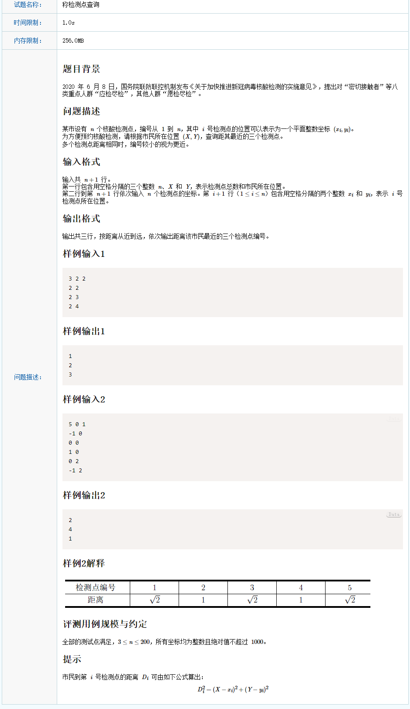
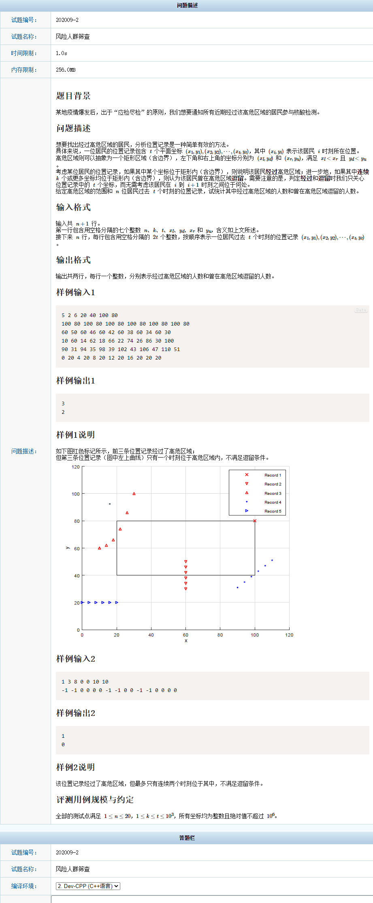

# 202009

## 1



```c++

// 模拟题目 比较简单
 


#include <cstdio>
#include <iostream>
#include <algorithm>
#include <map>
#include <vector>
#define max 2010
using namespace std;

int main() {
	
	int n, X, Y;
	int x, y;
	
	vector<long> dis(max, 0); // 注意不能声明动态变量 不然会RE
	multimap<long , int> mp; // 允许重复值的 自排序map
	cin >> n >> X >> Y;
	for (int i = 0; i < n; i++) {
		scanf("%d%d", &x, &y);
		dis[i] = (X - x )* (X - x) +  ( Y - y) * ( Y - y); // 用整数来存
		mp.insert(pair<long, int>(dis[i], i + 1));
	}
	
	map<long, int> ::iterator iter;
	int cnt = 0;
	for (iter = mp.begin(); iter != mp.end(); iter++){
		if(cnt == 3) break;
		cnt++;
		cout << iter -> second << endl;
	}
	
   return 0;
}
```

## 2



```c++
#include <cstdio>
#include <iostream>
#include <algorithm>
#include <map>
#include <vector>
#define max 2010
using namespace std;

int n, k, t, xl , yl, xr, yr;
int v[1005];
bool isIn(int x, int y) {
	if (xr >= x && x >= xl) { //  xl <= x <= xr
		if ( y >= yl && y <= yr) { // yl <= y <= yr
			return true;
		}
	}
	return false;
}

int main() {
	
	cin >> n >> k >> t >> xl >> yl >> xr >> yr;
	int x, y;
	int record[2] = {0};
	for (int i = 0; i < n; i++) {
		int cnt = 0;
		int flag = 0;
		for (int j = 0; j < t; j++) {
			scanf("%d%d", &x, &y); 
			
			if (isIn(x, y)) {
				cnt++;
				v[i] = 1;
			} else {
				cnt=0;
			}
			
			if (cnt >= k && flag == 0) {
				record[1]++;
				flag = 1;
			}
		}
		if ( v[i] == 1 ) record[0]++;

	}
	cout << record[0] << endl << record[1] <<endl;
   return 0;
}
```

